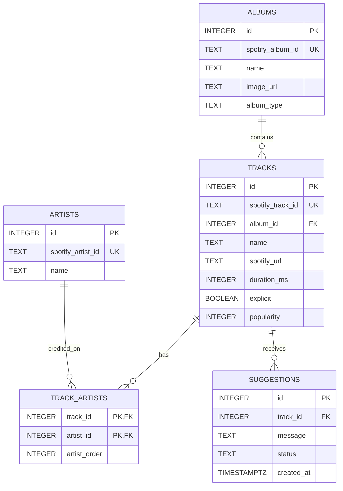

# Database Entity Relationship Diagram

```mermaid
erDiagram
    ARTISTS {
        INTEGER id PK
        TEXT spotify_artist_id UK
        TEXT name
    }

    ALBUMS {
        INTEGER id PK
        TEXT spotify_album_id UK
        TEXT name
        TEXT image_url
        TEXT album_type
    }

    TRACKS {
        INTEGER id PK
        TEXT spotify_track_id UK
        INTEGER album_id FK
        TEXT name
        TEXT spotify_url
        INTEGER duration_ms
        BOOLEAN explicit
        INTEGER popularity
    }

    TRACK_ARTISTS {
        INTEGER track_id PK, FK
        INTEGER artist_id PK, FK
        INTEGER artist_order
    }

    SUGGESTIONS {
        INTEGER id PK
        INTEGER track_id FK
        TEXT message
        TEXT status
        TIMESTAMPTZ created_at
    }

    ALBUMS ||--o{ TRACKS : contains
    TRACKS ||--o{ TRACK_ARTISTS : has
    ARTISTS ||--o{ TRACK_ARTISTS : credited_on
    TRACKS ||--o{ SUGGESTIONS : receives
```